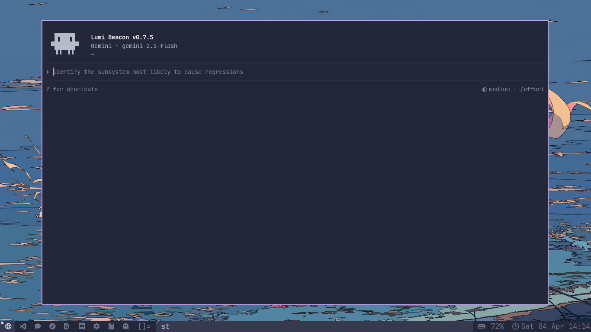

<h1 align="center">Lumi</h1>

<p align="center">
  Terminal AI coding workbench for repo intelligence, background execution, project memory, and prompt-first terminal workflows.
</p>

<p align="center">
  <strong>Current release:</strong> <code>v0.7.5: Beacon</code>
</p>

<p align="center">
  <a href="#install">Install</a> ·
  <a href="#quick-start">Quick Start</a> ·
  <a href="#whats-new-in-075">What's New</a> ·
  <a href="#beacon-workflow">Beacon Workflow</a> ·
  <a href="#commands">Commands</a> ·
  <a href="#development">Development</a>
</p>

<p align="center">
  
  
  
  
</p>
> Lumi is for real repo work: inspect, plan, edit, test, review, and ship from the terminal without collapsing into a generic chat loop.

<div align="center">
  <table>
    <tr>
    <td width="50%" valign="top">
        <strong>Beacon Workbench</strong><br>
        <code>/build</code>, <code>/learn</code>, <code>/review</code>, <code>/fixci</code>, and <code>/ship</code> map requests to risk-aware repo runs.
      </td>
      <td width="50%" valign="top">
        <strong>Repo Intelligence</strong><br>
        Symbol indices, hotspots, impact files, suggested tests, verification commands, and cached digests keep context ready.
      </td>
    </tr>
    <tr>
      <td width="50%" valign="top">
        <strong>Project Memory</strong><br>
        `LUMI.md` or `CLAUDE.md` conventions, decisions, recent runs, and artifact history persist across sessions.
      </td>
      <td width="50%" valign="top">
        <strong>Prompt-First TUI</strong><br>
        Starter card, prompt rail, compact transcript, menus, shortcuts, review cards, and the jobs pane stay in view.
      </td>
    </tr>
  </table>
</div>

## Why Lumi

- built around coding workflows, not generic chat
- can inspect a repo before changing it
- keeps lightweight workspace memory across sessions
- has both a full TUI and classic CLI mode
- includes release gates for benchmark and capability audits

## What's New In 0.7.5

`Beacon` is the name because this release is about direction and visibility: Lumi is more grounded in its own identity, gives clearer runtime signals, and makes repo work easier to track through permissions, context, telemetry, and workbench execution.

### Added

- Beacon release branding across the docs and release metadata
- real tool-permission management via `/permissions` with global and project rule files
- session telemetry via `/tokens` and `/cost`
- recent tool and shell log access via `/logs`
- stronger project memory and dynamic prompt context assembly
- hardened local self-knowledge so Lumi knows its own identity, creator, release line, and runtime
- VS Code handoff with `/ide` for opening the current workspace or a file directly from Lumi
- richer `/learn` surfaces for symbol search, references, and impact analysis
- benchmark publishing output via Markdown reports from the benchmark gate

### Changed

- prompt flow now behaves like a messaging app:
  the transcript grows first, then the prompt follows it downward until it reaches the bottom
- one spacer row now separates the startup header from the first message block
- Gemini-first startup with `gemini-2.5-flash` as the preferred default when configured
- `/model` only showing configured providers
- `/effort` support with real runtime profiles
- while Lumi is working, prompt input is locked and `Esc` is the stop action
- startup visuals stay ANSI-only with the minimal Claude-style mini bot and compact header
- self-identity follow-ups like `are you sure` now stay on Lumi instead of leaking host model identity
- status and doctor output with Workbench awareness

### Operational

- benchmark gate and rebirth audit remain part of the release path
- CI is aligned with current GitHub Actions runtime expectations

## Install

```bash
curl -fsSL https://raw.githubusercontent.com/SardorchikDev/Lumi/main/install.sh | bash
```

Useful variants:

```bash
curl -fsSL https://raw.githubusercontent.com/SardorchikDev/Lumi/main/install.sh | bash -s -- --dev
curl -fsSL https://raw.githubusercontent.com/SardorchikDev/Lumi/main/install.sh | bash -s -- --dir ~/apps/Lumi
curl -fsSL https://raw.githubusercontent.com/SardorchikDev/Lumi/main/install.sh | bash -s -- --help
```

The installer:

- clones Lumi into `~/Lumi`
- creates a local `venv`
- installs dependencies
- creates a `lumi` launcher in `~/.local/bin`
- creates `~/Lumi/.env` if it does not exist
- initializes runtime state under `~/.codex/memories/lumi`

## Quick Start

1. Add at least one provider key to `~/Lumi/.env`
2. Open a new shell or reload your shell config
3. Launch Lumi

```bash
lumi
```

Minimal `.env` example:

```env
GEMINI_API_KEY=
CLAUDE_API_KEY=
GROQ_API_KEY=
HF_TOKEN=
OPENROUTER_API_KEY=
MISTRAL_API_KEY=
AIRFORCE_API_KEY=
POLLINATIONS_API_KEY=
```

Good first commands:

```text
/onboard
/doctor
/model
/skills
/hooks
/learn architecture
/learn refs run_app
/build --plan add tests for parser errors
/ide status
/jobs
```

Good first prompts:

```text
/build implement rate limiting for the auth endpoints
/review workspace
/fixci repair the failing github actions workflow
/ship prepare release notes for the current branch
```

## Default Behavior

When configured, Lumi starts with these defaults:

- provider preference: Gemini first
- startup model: `gemini-2.5-flash`
- startup effort: `medium`
- `/model` only shows configured providers
- `?` opens the shortcuts overlay when the prompt is empty

Optional model allowlists:

```env
LUMI_GEMINI_MODELS=gemini-2.5-flash,gemini-2.5-pro
LUMI_HUGGINGFACE_MODELS=meta-llama/Llama-3.3-70B-Instruct
LUMI_ALLOWED_MODELS=gemini-2.5-flash
```

Useful runtime overrides:

```env
LUMI_HOME=~/Lumi
LUMI_STATE_DIR=~/.codex/memories/lumi/state
LUMI_CACHE_DIR=~/.codex/memories/lumi/cache
```

## Beacon Workflow

Beacon tightens the coding loop.

1. `/learn` maps the repo, conventions, hotspots, impact files, and suggested tests.
2. `/build` turns a request into a risk-aware implementation run.
3. `/review workspace` gives you repo-level review behavior instead of only single-file review.
4. `/fixci` targets lint, typecheck, test, or workflow failures.
5. `/ship` verifies the repo and prepares release artifacts.
6. `/jobs` shows active and completed Workbench jobs in the TUI.

### `/build`

Use when you want Lumi to inspect, plan, edit, test, and prepare artifacts for a coding task.

```text
/build implement structured logging for api requests
/build --plan refactor auth middleware
```

### `/learn`

Use when you want Lumi to understand the repo before making changes.

```text
/learn architecture
/learn payment flow
/learn symbol run_app
/learn refs Engine
/learn impact src/api/auth.py
```

### `/review`

Existing file review stays in place. Empty-target or `workspace` review routes through Beacon.

```text
/review workspace
/review src/api/auth.py
```

### `/fixci`

Use when the repo is failing lint, typecheck, tests, or CI.

```text
/fixci repair the failing pytest suite
/fixci fix the github actions benchmark gate
```

### `/ship`

Use when you want Lumi to verify the repo and prepare release artifacts.

```text
/ship prepare a release for the current branch
/ship --plan
```

### `/jobs`

Shows background Workbench activity in the TUI.

```text
/jobs
```

## Repo Intelligence

Every Workbench run starts with a repo scan and cached intelligence snapshot.

Current capabilities:

- language and framework detection
- entrypoint and config file discovery
- symbol index for common coding languages
- symbol search with `/learn symbol <name>`
- reference lookup with `/learn refs <name>`
- dependency hints from imports
- impact file suggestions and `/learn impact <path|symbol>`
- test target suggestions
- verification command discovery
- workspace warnings and context digests

## Project Memory

Lumi keeps lightweight workspace memory under the Workbench state directory.

It stores:

- conventions from `LUMI.md` or `CLAUDE.md`
- decisions made during runs
- recent Workbench executions
- generated artifact history

This keeps Lumi consistent across sessions instead of re-learning the repo from zero every time.

## TUI

Lumi's default interface is prompt-first:

- compact startup header on launch
- prompt rail and footer shortcuts
- transcript-first flow where the prompt follows the conversation downward
- command menus and model picker
- shortcuts overlay on `?`
- command palette on `Ctrl+P`
- TODO pane on `Ctrl+T`
- review cards and approval flows
- background Workbench jobs pane
- terminal-safe paste and selection behavior

Useful keys:

- `?` shows shortcuts
- `/` opens the command menu
- `Ctrl+N` opens the model picker
- `Ctrl+P` opens the command palette
- `Ctrl+T` toggles the TODO pane
- `Ctrl+G` toggles the starter card
- `Tab` accepts command or path suggestions
- `PgUp` / `PgDn` scroll menus and transcript
- `Shift+Up` / `Shift+Down` scroll the transcript
- `Esc` closes transient UI and cancels pending file plans

## Commands

### Core

| Command | Description |
|---|---|
| `/model` | Switch provider and model |
| `/effort [low\|medium\|high\|ehigh]` | Set reasoning effort |
| `/status` | Show session and workspace status |
| `/doctor` | Check provider and workspace health |
| `/onboard` | Show first-run and workspace guidance |
| `/skills [inspect <name>]` | List markdown skills or inspect one |
| `/hooks [inspect]` | Show lifecycle hook configuration |
| `/rebirth [status\|on\|off]` | Show the rebirth capability profile and toggles |
| `/benchmark [list]` | Show built-in benchmark scenarios |
| `/tokens` or `/cost` | Show token usage and session cost |
| `/logs` | Show recent tool and shell logs |
| `/clear` | Clear the current conversation |
| `/exit` | Exit Lumi |

### Beacon Workbench

| Command | Description |
|---|---|
| `/build <task>` | Inspect, plan, edit, test, review, and prepare artifacts |
| `/learn [topic]` | Build repo intelligence and explain architecture |
| `/review [file\|workspace]` | Review code or run workspace review through Workbench |
| `/fixci [goal]` | Repair CI, lint, type, and test failures |
| `/ship [goal]` | Verify the repo and generate release artifacts |
| `/jobs` | Show background Workbench jobs |

### Files, Git, and Context

| Command | Description |
|---|---|
| `/file <path>` | Load a file into context |
| `/project <dir>` | Load a project into context |
| `/browse [dir]` | Open the file browser |
| `/git status` | Show git status |
| `/git summary` | Summarize repo state |
| `/git review` | Review git changes |
| `/search <query>` | Search the web |
| `/web <url> [question]` | Ask questions about a webpage |
| `/image <path> [question]` | Inspect an image |
| `/voice [seconds]` | Record and transcribe voice into the prompt |
| `/ide [path\|status]` | Open the workspace or a file in VS Code |

### Memory, Plugins, and Productivity

| Command | Description |
|---|---|
| `/remember <fact>` | Save a long-term memory |
| `/memory` | View stored memories |
| `/note add\|list\|search` | Manage notes |
| `/todo add\|list\|done\|rm` | Manage todos |
| `/lumi.md show\|create` | Show or create Lumi project context |
| `/claude.md show\|create` | Show or create Claude Code-compatible project context |
| `/plugins` | Show plugin status |
| `/permissions [all\|plugins\|mode\|add\|rm]` | Show or update tool permissions, plus plugin permission info |

## Skills and Hooks

### Skills

Lumi can turn markdown files into slash commands.

- workspace roots: `./skills/` and `./.lumi/skills/`
- global root: `~/Lumi/skills/`
- runtime command: `/skills`
- dynamic execution: each discovered skill command appears in the `/` menu and runs through Lumi's normal model, memory, and repo context stack

Example skill:

```markdown
---
name: Release Helper
command: /release
description: Draft release notes for the current branch.
---
Draft release notes for {{args}} in {{workspace}}.
```

### Hooks

Hooks provide deterministic shell automation around Lumi lifecycle events.

- config roots: `./hooks.json`, `./.lumi/hooks.json`, and `~/Lumi/configs/hooks.json`
- supported events: `before_message`, `after_response`, `before_command`, `after_command`
- runtime command: `/hooks`

Example hook config:

```json
{
  "before_message": [
    {
      "name": "lint-guard",
      "command": "printf '%s' \"$LUMI_HOOK_INPUT\""
    }
  ]
}
```

## Rebirth Profile

`Beacon` is the release name. `Rebirth` is still a runtime profile.

Use `/rebirth` to view the capability matrix and readiness score for core coding-agent workflows.

Use `/rebirth on` to apply the profile defaults:

- detailed response mode
- compact mode off
- guardian watcher on

## Benchmarks and CI

Lumi includes two release gates:

- `scripts/benchmark_gate.py`
- `scripts/rebirth_audit.py`

The CI workflow prints gate diagnostics directly into logs when a failure happens. `scripts/benchmark_gate.py` can also emit machine-readable JSON and Markdown benchmark reports.

## Project Context

If a repo contains `LUMI.md` or `CLAUDE.md`, Lumi loads it automatically as project context and Workbench memory seed data.

Example:

```markdown
# Project Context

## Stack
Python 3.11, FastAPI, PostgreSQL

## Conventions
- Type hints everywhere
- Use pytest
- Keep functions small
- Ship concise release notes
```

## Project Structure

The repo is intentionally source-first. Runtime state, caches, sessions, and generated packaging files are not part of the tracked project layout.

```text
.
├── configs/         configuration and benchmark gate inputs
├── docs/            docs assets and supporting media
├── scripts/         audit and benchmark entry scripts
├── src/
│   ├── agents/      agent loop, council, verification, edit engine
│   ├── chat/        provider clients, model catalogs, cost, effort controls
│   ├── cli/         classic CLI parsing, rendering, and shared context
│   ├── memory/      conversation store, short-term memory, long-term memory
│   ├── prompts/     system prompt and dynamic context building
│   ├── tools/       agent tool runtime, search, MCP, RAG, voice
│   ├── tui/         prompt-first terminal UI, views, input, session state
│   └── utils/       repo profile, permissions, hooks, export, git helpers
├── tests/           unit and integration coverage
├── install.sh       installer
├── lumi             launcher shim
├── main.py          classic CLI entrypoint
└── README.md        project overview
```

Structure notes:

- `src/` is the real product surface.
- `configs/`, `scripts/`, and `tests/` support that surface.
- runtime state lives outside the repo under Lumi's state/cache directories, not in tracked source folders.
- generated files like `egg-info`, undo snapshots, model caches, and local memory artifacts are intentionally ignored.

## Development

```bash
git clone https://github.com/SardorchikDev/Lumi.git ~/Lumi
cd ~/Lumi
python3 -m venv venv
source venv/bin/activate
pip install -e ".[dev]"
pre-commit install
```

Checks:

```bash
pytest -q
ruff check .
python scripts/benchmark_gate.py --config configs/benchmark_gate.json
python scripts/rebirth_audit.py --strict
```

## License

[MIT](LICENSE)
